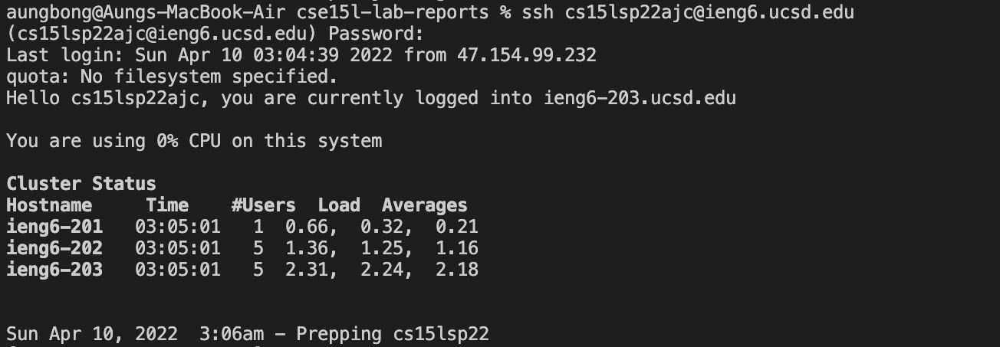
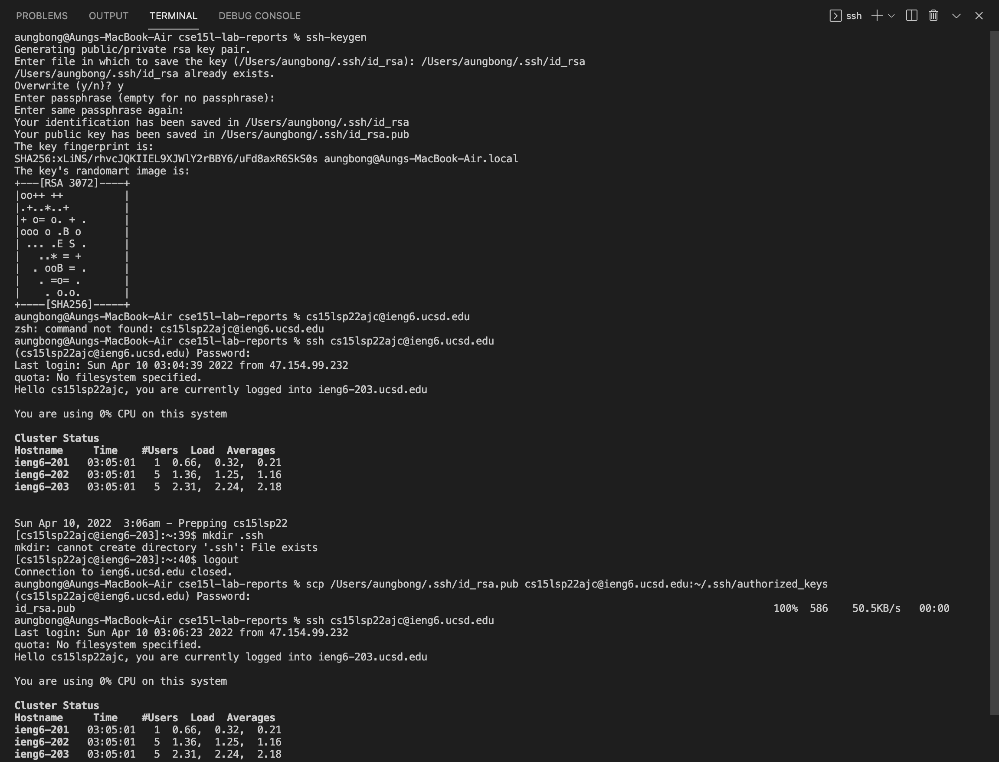

## Aung Myat, April 8th, 2022
## Lab Report 1
[Link to back to my index.md file](https://ruff1ezzz.github.io/cse15l-lab-reports/index.html)

***

**Lab 1:**

1) In **Lab 1**, first I met my lab group and introduced each other. Then I was prompted to download VS Code, which I already did. And then we worked on remotely connecting to  our ieng6 accounts server by inputing `$ ssh cs15lsp22ajc@ieng6.ucsd.edu` into the terminal and after entering the password to my account, I got the result of:



2) Afterwards, I worked on running commands, such as 

* `ls` - list files
* `cd` - change directory
* `ls -t` - list files in order of time they were last modified
* `ls -l` - long list of files
* `dir` - directory
* `pwd` - prints the full path of current/working directory

in the ieng6 server:


3) Then, I learned how to move files from my computer to the ieng6 server using the scp command, `scp WhereAmI.java cs15lsp22ajc@ieng6.ucsd.edu:~/`. 

First, I created a file called WhereAmI.java and added the following code, which gives me the information of my system.

```
class WhereAmI {
  public static void main(String[] args) {
    System.out.println(System.getProperty("os.name"));
    System.out.println(System.getProperty("user.name"));
    System.out.println(System.getProperty("user.home"));
    System.out.println(System.getProperty("user.dir"));
  }
}
```

Then I saved the file and typed `scp WhereAmI.java cs15lsp22ajc@ieng6.ucsd.edu:~/` command to copy and move that file into my ieng6 account server. So once the transfer was complete, I checked to see whether the file was in my directory by inputting `$ ls` in the ieng6 computer. Once the file was there, I inputted `$ javac WhereAmI.java` and `$ java WhereAmI` in the ieng6 computer, which gives me the following result:


4) Finally, I learned how to create a ssh keygen to log into my ieng6 server account faster and more efficiently without typing my long password. Firstly, I input `$ ssh-keygen` into my computer cliet, then I had to put in the file path of where I want to save the key in and press enter twice to leave it as no passphrase. Then after the system generated and saved the key, I log into my ieng6 account by running `$ ssh cs15lsp22ajc@ieng6.ucsd.edu` command and entering my password to input `$ mkdir .ssh` in the ieng6 computer client. Then I logged out and inputted `$ scp /Users/aungbong/.ssh/id_rsa.pub cs15lsp22ajc@ieng6.ucsd.edu:~/.ssh/authorized_keys`, which connects to the keygen and then when I log back into my ieng6 server account, I no longer need to enter my password. Below is the image of the whole process:



***

**Lab 2:**

1) In **Lab 2**, I worked on creating a new GitHub account. First, I created a new account, then I created a new repository in my account to start a new project and named it `index.md`. Then I edited the file by writing some sentences. Then I went to settings --> page and set the branch setting to main, which then gave me the access to the website link of my `index.md` file website. 

[Click me to access my index.md website](https://ruff1ezzz.github.io/cse15l-lab-reports/index.html)

2) Secondly, I learned the basic syntax of the MarkDown language and made a new file, named "`MarkDownPractice.md`". Some of the basic syntaxes were:

```
- *Italic*
- **Bold**
- # Heading 1
- ## Heading 2
- [Link](http://a.com)
- 
```

Here is the picture of some of the edits I used in my `MarkDownPractice.md` file:


[Click me to access my MarkDownPractice.md website](https://ruff1ezzz.github.io/cse15l-lab-reports/MarkDownPractice.html) : for more edits using MarkDown syntax cheatsheet.

3) Futhermore, I learned how to access the websites of different files from the same repository. All you need to do is add `/<filename>.html` at the end of your repository website.

For example,
```
https://ruff1ezzz.github.io/cse15l-lab-reports
- My repository website
https://ruff1ezzz.github.io/cse15l-lab-reports/index.html
- To access the index.md file on the website
```

4) 
