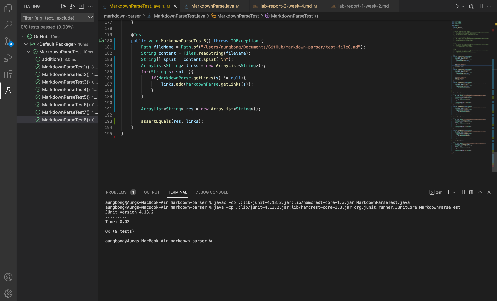

# Aung Myat, April 22nd, 2022
# Lab Report 2
[Home Page](https://ruff1ezzz.github.io/cse15l-lab-reports/index.html)

***

**Lab 3:**

## 0) Pair Programming

In **Lab 3**, first, I watched an informational video on pair programming.

[Link to the pair programming video](https://www.youtube.com/watch?v=vgkahOzFH2Q&ab_channel=Code.org)

## 1) Getting Started

Then, I had to watch another video on how the a programmer incrementally coded the MarkDown parsing implementation. 

[Link to the implementation video](https://youtu.be/k67e-Icw4ug)

Afterwards, I answered questions on about the video, such as:
* How many times did the programmer use the internet to look up how to do something?
* Around what was the largest number of lines of code written in between runs of the program?
* Around how many times did the programmer use autocomplete on a variable name? How many typos do you think this helped avoid?

## 2) Getting and Running the Code

Furthermore, I was prompted to fork, which is a complete copy of the repository that sits in your account, a given repository, which contained two files:

* `MarkdownParse.java`
* `test-file.md`

Repository to fork - [link](https://github.com/nidhidhamnani/markdown-parser)

After forking/cloing the repository, I made sure I can run it by using the commands form the video:

* `javac MarkdownParse.java`
* `java MarkdownParse test-file.md`

Then we added print statements in the code to check and answer the following questions:

1) How many different values does `currentIndex` have when the program is run on the given example? What are they?

**ANS** - `currentIndex` has 3 different values when the code runs. They are 0, 39, 64.

2) What is the purpose of the second argument to `indexOf`? What would be different if it wasn't provided?

**ANS** - The purpose of the second `indexOf`, is to start the search for the starting argument form the position of the second argument. If there isn't a second argument there, an infinite loop would occur when you run the program due to a missing bound.

## 3) Finding a breaking test

Afterwards, my parter and I tried to come up with different tests until we get something that has incorrect behaviors (an error, an infinite loop, prints the wrong URLs, etc).

We then commited a new file and write out our test case.

Shortly after, we had to answer another question - Why bother making a commit at this point? What benefit might that have in the future? How might it help a staff member who is answering your question on Piazza?

**ANS** - By making a commit, it allows us to see the history of our commit in our main repository and helps the staff member on Piazza to easily spot it in our github accounts by tracking what we did wrong step by step.

## 4) Improving the program

Then we started to perform incremental coding. Incremental coding means to start from a few lines, to minimize errors and to avoid debugging long lines of codes. With this practice my partner and I tried to develop a better program to parse markdown files.

We tried to come up with a better solution to eliminate edge cases such as having an extra paranthesis in side the website like the following:

`[https://www.goo(g)le.com]`

Although we couldn't completely find the solution, we learned the practices of incremental development and later we commited our effort into the main github to get a feedback from tutors.

## 5) Repeating the process

Finally, we repeated the same process of first finding a failed test and then performing incremental development to fully improve the program.

***

**Lab 2:**

*I couldn't make it to this lab due to health reasons so I worked on it myself.*

## 1) Your memory

Firstly, I re-tested the `MarkdownParse.java` file with the three other test files that me and my partner created in Lab 3 by entering the code `java MarkdownParse.java *file-name*` into the terminal. One of the test file that I wrote doesn't work because it has some closed or open brackets in the website for example:

> `# Title`
>  
>  
>`[link1](https://something.()com)`
 
`[link2](https://google.(com))`

## 2) Running via Command Line

In this step, I was prompted to time how long the compiling process takes when we type `java MarkdownParse *test-files*` into the command line after adding a print statement in the main method of `MarkdownParse.java` file. I did this for 4 test files including the original test file, and in total the time it took was approximately 28 seconds.

## 3) Setting up JUnit

Afterwards, I learned how to set up JUnit.

1) First off, I downloaded two `.jar` files:
* `junit-4.13.2.jar
* hamcrest-core-1.3.jar

2) Then, I made a directory called `lib` in my project, and copied both of those files to that directory. Consequently, I commited an push the files once they are added to `lib` so I can see it in my main repository.

3) I then, created a file called `MarkdownParseTest.java` file in my repository and put the following code in the file:

>import static org.junit.Assert.*;
 
import org.junit.*;
 
public class MarkdownParseTest {
 
....@Test
 
....public void addition() {
 
........assertEquals(2, 1 + 1);
 
....}
 
}

Then, I ran the following code in the terminal:

* `$ javac -cp .:lib/junit-4.13.2.jar:lib/hamcrest-core-1.3.jar MarkdownParseTest.java`
* `$ java -cp .:lib/junit-4.13.2.jar:lib/hamcrest-core-1.3.jar org.junit.runner.JUnitCore MarkdownParseTest`

These two lines of code...
1) Imports Assert form JUnit
2) Import all of JUnit
3) Runs the markdownparser file

Finally, I commited to my github repository.

Below is the image after setting up the JUnit test and testing a simple math equation:

## 4) Writing tests with JUnit

We then had to write JUnit tests for the `getLinks()` method in my `MarkdownParse.java` file.

In the `MarkdownParseTest.java` file I first wrote a JUnit test with the original `test-file.md` file, and compile using the two commands:

* `$ javac -cp .:lib/junit-4.13.2.jar:lib/hamcrest-core-1.3.jar MarkdownParseTest.java`
* `$ java -cp .:lib/junit-4.13.2.jar:lib/hamcrest-core-1.3.jar org.junit.runner.JUnitCore MarkdownParseTest`

...which gave me the result of:

Since there were no error I went ahead and commited and push this into my github `markdown-parser` repository.

Then I wrote more tests using the other test files that I wrote and after getting positive tests I commited and pushed the changes into my gihub `markdown-parser` repository again.

## 5) Benefits of automated test

In this step, I was asked to compare the efficiency between testing using JUnit vs testing each file individually. I didn't particularly timed myself performing the JUnit test when I use the automated way of the test, but I can still clearly see that the automated method of using JUnit test is so much faster since there isn't any typing involved.

## 6) More tests, and Symptoms vs Bugs

Ultimately, I was prompted to write even more tests for the `getLink()` method using test files from the orignial `markdown-parse` repository and find failure inducing inputs from those test files.

Below is the picture of the results I got after testing the test files:

Out of the eight test-files:

* In my version of MarkdownParse, `test-file 2` and `test-file 8` had *failure-inducing* inputs.

* No pair of `test-files` has the same failure-inducing inputs so I have 2 bugs in my implementation based on the `test-files`.

* The bug in `test-file 2` is unknown to me but the bug in `test-file 8` is due to having an extra `"["` symbol at the end.

After fixing the bugs that make the *failure-inducing* inputs.

In conclusion, among the 8 `test-files` that were given for us to test, the two tests that had *failure-inducing* inputs didn't have a similar bug. I couldn't figure out the bug for `test-file 2` but for `test-file 8`, there was an extra symbol that was restricting the link to be added. The `bug` was that it detects the extra symbol and giving out a `symptom`, which gives out the wrong answer than expected. Therefore, I fixed the JUnit test code in the `MarkdownParseTest.java` file, by adding the split method within a for loop, which ignores repeated characters. After doing this I fixed the *failure-inducing* input for both `test-files` and got the result that I want.

