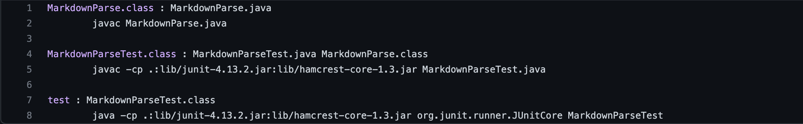
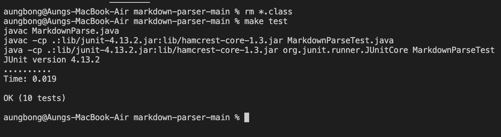
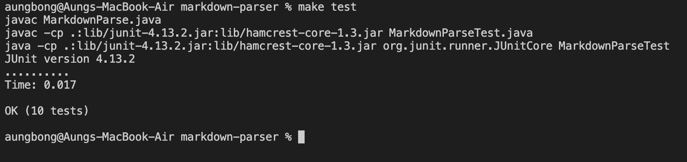
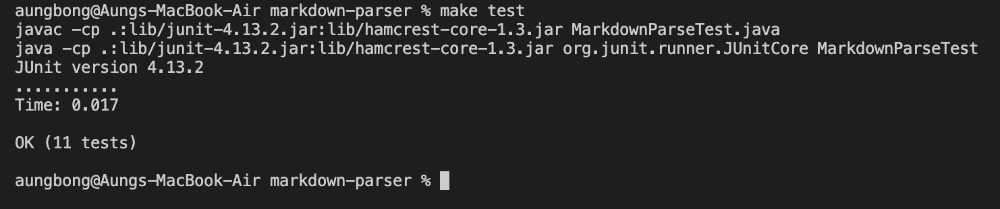
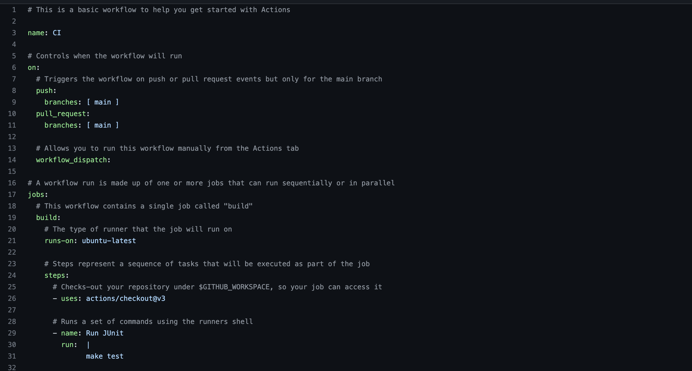
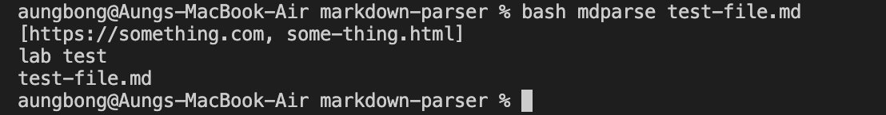

# Aung Myat, May 3rd, 2022
# Lab Report 3
[Home Page](https://ruff1ezzz.github.io/cse15l-lab-reports/index.html)

***

**Lab 5:**

## 1) Synchronize Your Group Work

Before we start the lab, we updated our repositories with the latest and most efficient `markdownparse` method.

## 2) Setup Github Actions on a Repository
Then we set up **Github Actions** on my `MarkdownParse` repository. 

>**Github action** - One of the greatest tools available for >continuous integration.
>
>- Other common tools: Jenkins, TeamCity, Bamboo, Buddy, Travis Cl.

First, I clicked on `Actions` on my github repository. Then, I select `set up a workflow yourself`. Then, I named the file: `main.yml`.

In the yml file, I deleted some unnecessary lines and added the following code in the `run` area. Below is my input:

This would then give me the access to running my tests in Github Action. I first created a failed test in my `MarkdownParseTest.java` file to check Github Action response to a failed test. Below is the result when I commited and pushed to the main repository:

The above error is occuring because I needed to delete all the `.jar` files from `gitIgnore`. After doing so I got another error:

This error was rather simple to fix because it was just that I used the full file path like: `/Users/aungbong/Documents/GitHub/markdown-parser/testFiles/...` as input files in my `MarkdownParseTest.java` file. After fixing it I got:

Afterwards, I commited and pushed to my main repository.

## 3) Improve markdown-parse

In this step, I had to improve our `Markdown-parse`, and use Github Action to test and fix a new failure inducing file.

First, I created a failure inducing file:
[Failure Inducing file](https://github.com/ruff1ezzz/markdown-parser/runs/6236776143?check_suite_focus=true)

Then, my partner and I tried to improve our `MarkDownParse` method and got a fix:
[Fix to issue](https://github.com/ruff1ezzz/markdown-parser/runs/6236814069?check_suite_focus=true)

## 4) Streamline ssh Configuration

Usually, when I log into my ieng6 accoutn form my laptop, I have to type a long line of `$ ssh cs15lsp22ajc@ieng6.ucsd.edu`. But there is a way to access the account without typing this long line everytime you want to access it.

* First, I have to access my `.ssh` directory. 
* In order to access it, in the terminal, I first typed `$ cd ~` which would lead me to my houme directory. 
* Once I am in my home directory, I typed `$ ls -a` to find any `.ssh` directory is one of the hidden directories.
* Then I typed `$ cd .ssh` which leads me inside the `.ssh` directory.
* Afterwards, I added a `config` file in the directory.
* Finally I added the following code:

>Host ieng6
>
>____HostName ieng6.ucsd.edu
>
>____User cs15lsp22ajc

After all the above step, I cleared my terminal and tried logging into my ieng6 account again. But this time just simply typing: `$ ssh ieng6` and got logged in instantly.

## 5) Set up Github Access from ieng6

After setting up Github Access from ieng6, this is the result I got because I didn't commit, push or pull anything from or to my ieng6 account.

## 6) Copy Whole Directories with scp -r

In the end of this lab, I learned how to copy whole directories into the ieng remote server.

In the picture above, first I checked if the directory that I want to copy has everything in it.

Then all I had to type was `$ scp -r . ieng6:markdown-parse` and got the whole directory copied into my ieng6 server account.

***

**Lab 6:**

## 1) Setup

For setup, first my partner and I cloned a fresh copy of the latest and most updated markdown-parse version that our group came up with. Then we timed the runtime of the tests using a timer in VScode and it took about 15 secounds to run the `JUnit` tests and `MarkdownParse` from the command-line with test-file.md as input.

## 2) Makefile

In this step, I had to create a new file and name it `makefile`.Then I typed the following code in:

To test using `makefile`, I had to type in `$ make test` in the terminal.

* The first test that was required was when I had no `.class` files in my `markdown-parser` directory. I removed all the `.class` files by entering `$ rm *.class` in the terminal. Then typing `$ make test`. Result:

* The next test that was required was when there were `.class` files present in my `markdown-parser` directory and editing `MarkdownParse.java` file. After entering `$ make test` again, all three commands ran because I updated MarkdownParse so it had to create a new class file to run it.

* The final test that was required was when there were `.class` files present in my `markdown-parser` directory and editing `MarkdownParseTest.java` file. After endtering `$ make test` once more, only two commands ran since `MarkdownParse` wasn't changed, only the Tester file was changed, so only that got compiled.

Then, I changed the code in the `run` area to just `make test` so Github action uses the `makefile` to run tests.

[Link to updated github actions using make test](https://github.com/ruff1ezzz/markdown-parser/actions/runs/2284642403)

## 3) Bash Scripting

In this step, I learned how to utilize bash scripting.
* First I created a new file and named it `mdparse`.
* Then I typed in the following code:

>`java -cp lib/junit-4.13.2.jar:lib/hamcrest-core-1.3.jar:. MarkdownParse $1`
>
>`echo $1`

* And then to run this bash script, in the terminal, I typed in `$ bash mdparse test-file.md`. Which then give me the output:

The code `echo $1` in my bash script means the first argument of the input files.

## 4) Improvement

In this step, we repeated the procedure using the timer to time the runtime of MarkDownParse after working on makefile and mdparse. The total time it took to run both tests was about 10 seconds.

## 5) Learning how Autograder works

In the end of this lab, I learned how an autograder works.

* First, I forked a given repository which basically grades my markdown-parse methods.

[Link to given repository](https://github.com/Will-Hsu/grade-markdown-parse)

* Then I cloned it into my github desktop to run it on VSCode.

* After running the `grade.sh` file in the `grade-markdown-parse` repository, I found out that `grade.sh` file clones the inputted repository link and then copies GradeTests.java and runs the test.

In conclusion, After submitting a PA, the first thing that happens is that the bash and command line is run and uses the hidden tests to see if the code is right. This is why it is important to make method names and certain variables the same as on the writeup.