# Aung Myat, May 20th, 2022
# Lab Report 4
[Home Page](https://ruff1ezzz.github.io/cse15l-lab-reports/index.html)

***

**Lab 7:**

## 1) Initial Review

Firstly, we all got a `MarkdownParse` repository of another team. And we analyzed their `MarkdownParse`.

[Link to my group's repository](https://github.com/colecarter96/markdown-parser)

[Link to the other group's repository we reviewed](https://github.com/philliptwu/markdown-parser)

1.1) Clean Coding

Our group analyzed the other group's code in terms of clean coding by considering the following metrics:

* Meaningful names (eg. int d vs int elapsedDays)
Avoid disinformation (eg. accountList only if it is a List)
* Using pronounceable names (eg. getTime() instead of gethhmmss())
* Use searchable names - (Single letter names and numeric constants are not easy to locate, should only be used for very short methods or loop counters)
* Upper case for constants (eg. double PI)
* Functions should have verb names(eg. deletePage() )
* Functions should be small with a maximum indent level of 2
* Functions should do only one thing. 
* Functions should usually have less than 3 arguments.
* Project should not have dead code or unreachable code (code that is never run).
* Avoid code duplication
* Correct formatting that makes the code readable 
* Rational usage of comments in code 
* Other clean coding principles discussed in class

2) Then we ran different test cases using their `MarkdownParse`.

We saw that there were some test cases that we had but they don't so we added them to their repository and ran them too.

Then we found two different issues to report on.

3) Discussion

In this step, we split up in half and half of us went to the other group to give them live feedback, meanwhile the other half stayed in the group to receive feedback from the other group.

**Lab 8:**

## 1) Editing at the Command Line

At the start of this lab, I had to practice text editing in vim.
To do this, in the terminal, I typed `vimtutor` and took me through a step by step introduction on how to use vim. 

## 2) Using a Debugger

In this step of the lab, we practiced the usage of `JDB` to debug our code.

1) Firstly, we were required to clone a fresh copy of the latest markdown-parse repository from our TA either in our ieng6 server account or using Github Desktop. I used Github desktop to clone the repository. [Repository Link](https://github.com/nidhidhamnani/markdown-parser.git)

2) I then ran the test by typing in `$ make test` in the terminal and got 1 failed test.

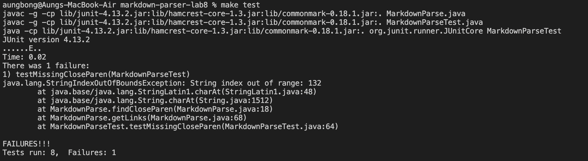

3) This is when `JDB` debugger comes in handy.

Some useful `JDB` commands:
* `run` - To start the execution of the debugged application
* `where` - To view the stack trace of the current thread
* `locals` - To view the local variables in the current stack frame
* `up/down` - To move between stack frames
* `suspend` - Suspends execution of any or all threads
* `threads` - Lists the threads that are currently running

Firstly, I spotted the failure inducing test case.

Then I use `jdb` with MarkdownParse to run just that markdown file from the command line using the main method of MarkdownParse by typing: "`jdb MarkdownParse <file-for-which-test-fails>`".

I then use the six `jdb` commands I mentioned above to see how they work.

Result:
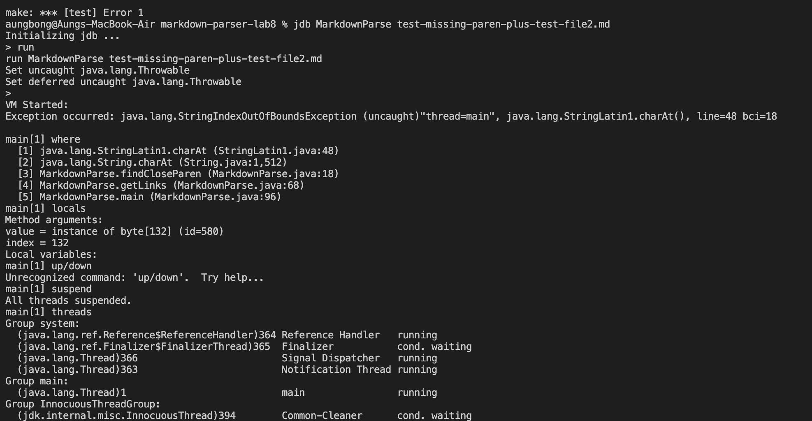

4) Then I learned to use jdb to run `JUnit` `tests`. What I had to type was similar to the java command in the `makefile`. Code below:

`jdb -classpath "lib/junit-4.13.2.jar:lib/hamcrest-core-1.3.jar:lib/commonmark-0.18.1.jar:." org.junit.runner.JUnitCore MarkdownParseTest`

After typing this, and after jdb got initialized, I used the catch command - "`catch java.lang.StringIndexOutOfBoundsException`", which prevent the jdb session from exiting.

Then I traced the stack when the exception is happening and got the local variables in `getLinks` when the exception is happening.

Below is the pic of my demostration for this step:

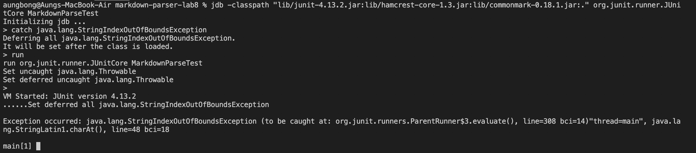

Catching the exception so the jdb session won't exit when I run it

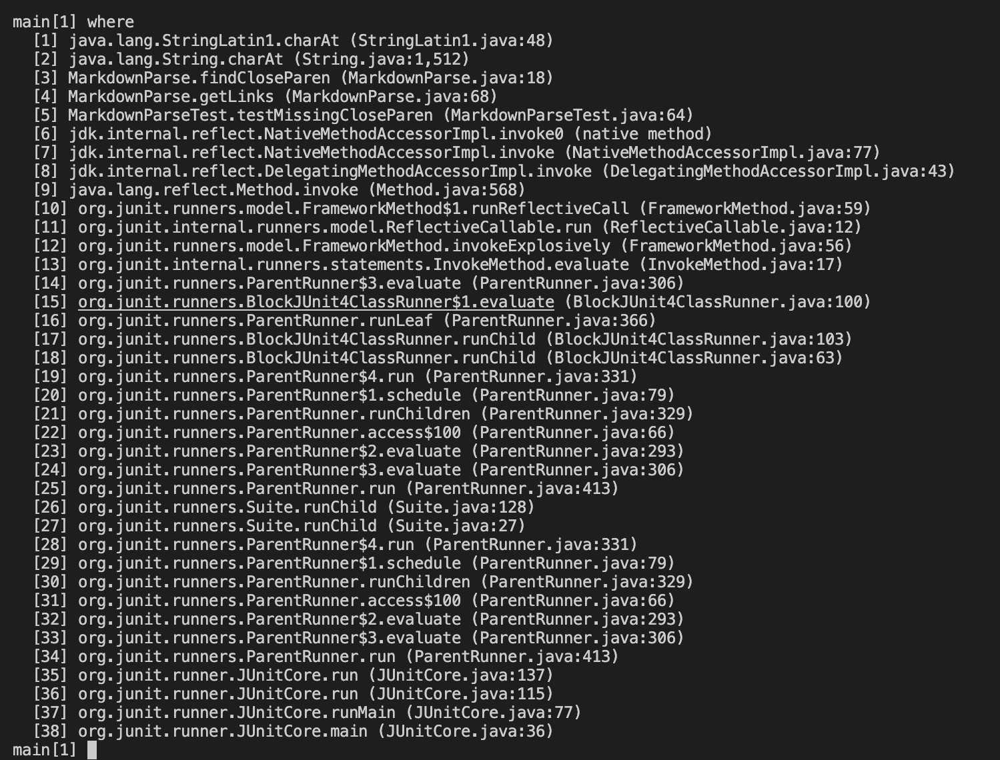

Stack tracing

Locals variables in `getLinks` when the exception is happening.

5) Finally, I had to fix the error and I did it by adding the following into the code:

and it finally passed...

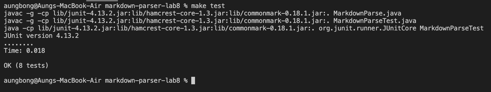

## 3) More Debugger Uses

In this step, I had to make another error, specifically an infinite loop error, so I can use jdb to debug it.

1) First, in order to make an infinite loop error, I deleted `closeParen++` in one of the methods, which would create an infinite loop error when I run `$ make test` and I had to stop it using `ctrl + c` command.

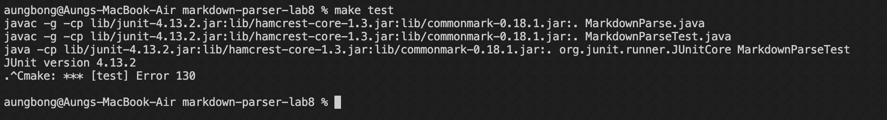

2) I then used the `run` and `suspend` jdb commands to pause the program and show the stack trace during the loop. I then used `where` and `locals` command to see the stack trace and see the local variables in `findCloseParen` after suspended. 
Below is the picture of the demonstration.

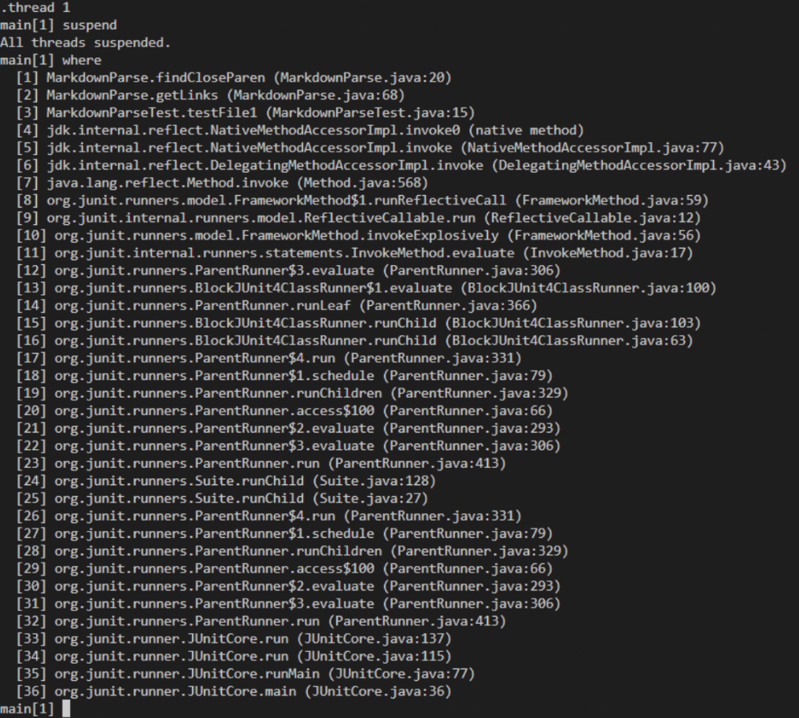

The stack trace after the suspension

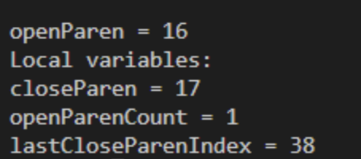

The local variables of `findCloseParen` after suspension.

**Additional Lab Report Requirements**

[Link to my group's repository](https://github.com/colecarter96/markdown-parser)

[Link to the other group's repository we reviewed](https://github.com/philliptwu/markdown-parser)

Firstly, in order to figure out the expected outcome for each snippet test cases, I used the [the CommonMark demo site](https://spec.commonmark.org/dingus/). 

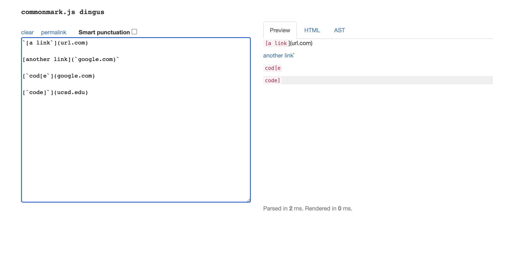
For snippet 1, I decided the expected url outcome would be [`url.com`,`google.com`,`ucsd.edu`] because all three of these links are written correctly while the second link contains a ticker symbol in the link section, making it an invalid link.

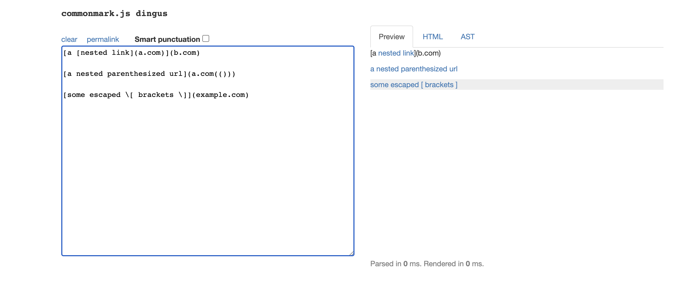
For snippet 2, I decided the expected url outcome would be [`a.com`,`example.com`] because in the preview, it shows that `a.com` is valid although it is written in the text section of another link syntax. And for `example.com` it was a valid link as shown in the preview.

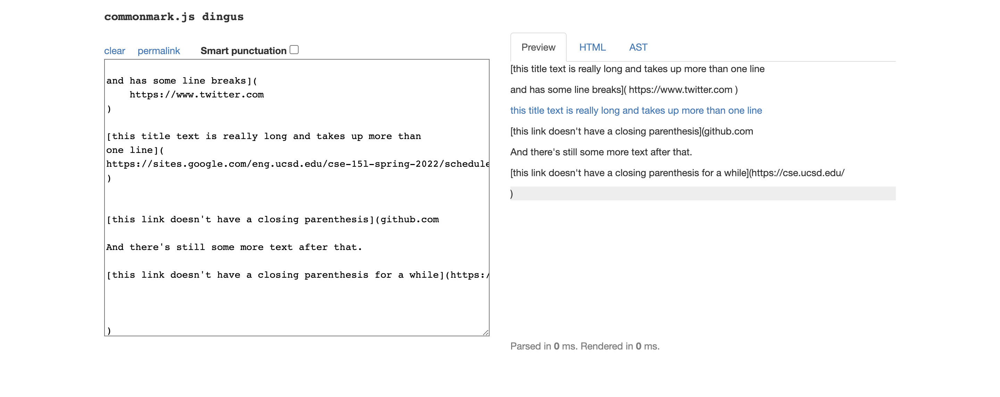
As for snippet 3, the only expected url outcome I decided that would be included is: [`https://sites.google.com/eng.ucsd.edu/cse-15l-spring-2022/schedule`] because it is the only link that is written in the correct markdown syntax.

Tests/expected output in `MarkdownParseTest.java` in my MarkdownParser:

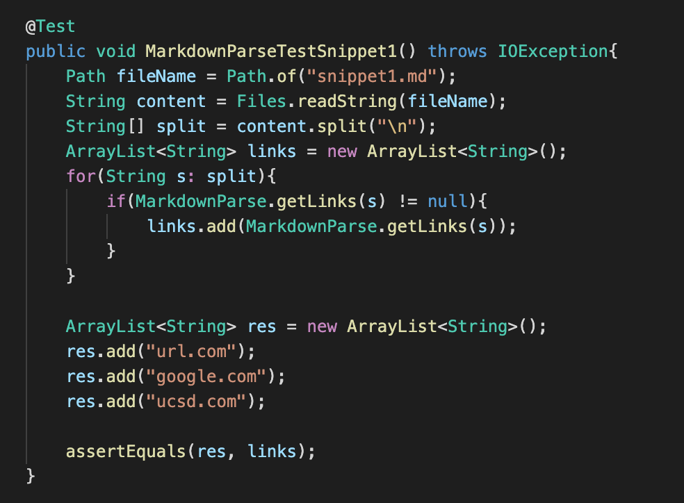

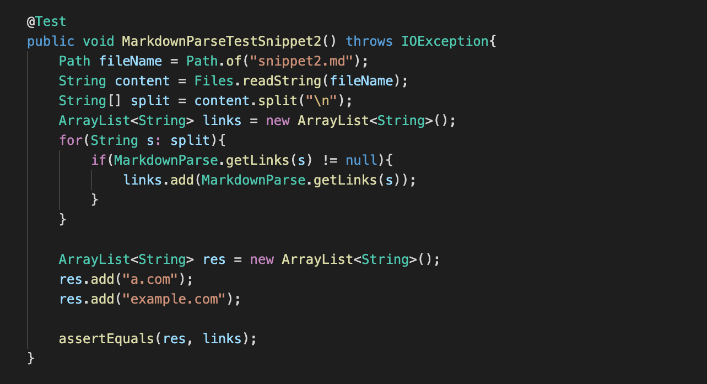

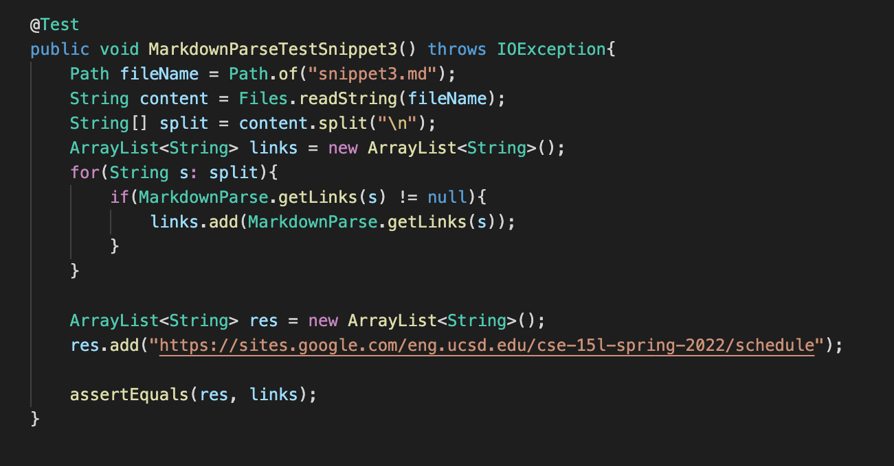

Tests/expected output in `MarkdownParseTest.java` in the MarkdownParser that my group reviewed:

After running my test cases:

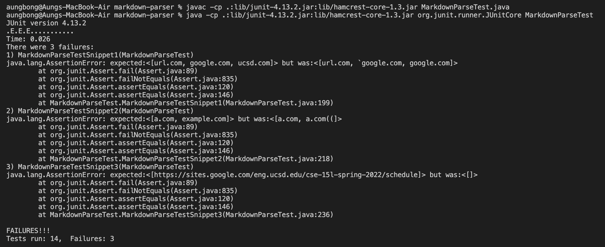

The reason for our tests' failure is because we didn't implement our markdownparser to detect other unneccessary symbols inside the link, that makes it the link invalid so it was still parsing down the invaild links.

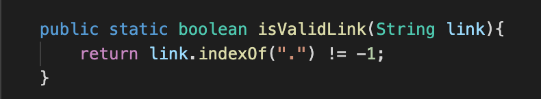

For my group's implementation, this method above was the specific part where we can fix the error.

After running their test cases:

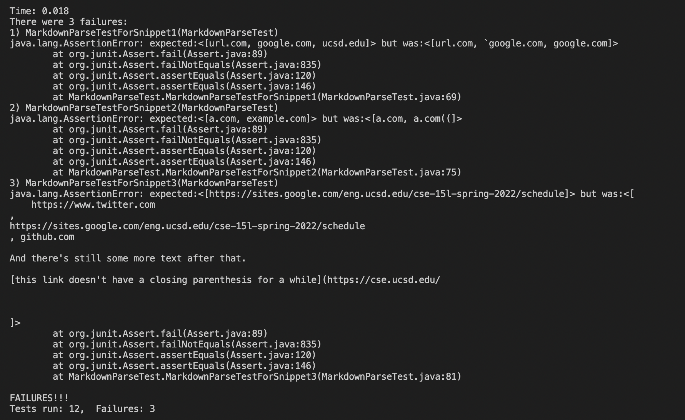

It's the same case with their markdownparse. They also didn't detect symbols that makes the link invalid so it was parsing invalid links.

Questions:

* Do you think there is a small (<10 lines) code change that will make your program work for snippet 1 and all related cases that use inline code with backticks? If yes, describe the code change. If not, describe why it would be a more involved change.

I think all I need to do is to make my markdownparse method ignore tick symbols if it's in the text secion of the markdown link syntax. And if the tick symbol is in the link section of the markdown link syntax, make that link invalid.

* Do you think there is a small (<10 lines) code change that will make your program work for snippet 2 and all related cases that nest parentheses, brackets, and escaped brackets? If yes, describe the code change. If not, describe why it would be a more involved change.

For snippet 2, it would be a more complicated step because there is a line where there is a link inside the text section of the markdown link syntax. But for the link with brackets, we can just add the brackets as an invalid link in our `isValidLink` method.

Do you think there is a small (<10 lines) code change that will make your program work for snippet 3 and all related cases that have newlines in brackets and parentheses? If yes, describe the code change. If not, describe why it would be a more involved change.

I think snippet 3 will also take more than 10 lines to fix becuase we have to check the number of spaces, the extra texts in the link section of the markdown link syntax and add more stuff to my `isValidLink` method.
