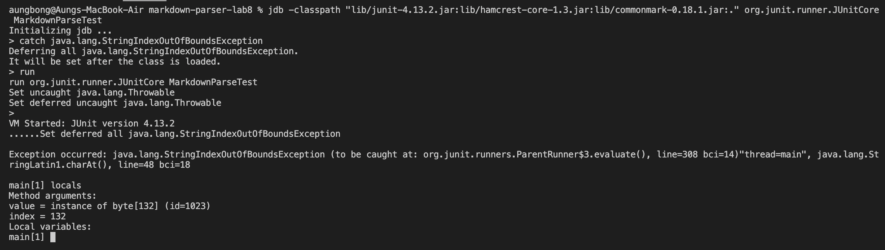

# Aung Myat, May 20th, 2022
# Lab Report 4
[Home Page](https://ruff1ezzz.github.io/cse15l-lab-reports/index.html)

***

**Lab 7:**

## 1) Initial Review

1.1) Fistly, we 

**Lab 8:**

## 1) Editing at the Command Line

At the start of this lab, I had to practice text editing in vim.
To do this, in the terminal, I typed `vimtutor` and took me through a step by step introduction on how to use vim. 

## 2) Using a Debugger

In this step of the lab, we practiced the usage of `JDB` to debug our code.

1) Firstly, we were required to clone a fresh copy of the latest markdown-parse repository from our TA either in our ieng6 server account or using Github Desktop. I used Github desktop to clone the repository. [Repository Link](https://github.com/nidhidhamnani/markdown-parser.git)

2) I then ran the test by typing in `$ make test` in the terminal and got 1 failed test.

3) This is when `JDB` debugger comes in handy.

Some useful `JDB` commands:
* `run` - To start the execution of the debugged application
* `where` - To view the stack trace of the current thread
* `locals` - To view the local variables in the current stack frame
* `up/down` - To move between stack frames
* `suspend` - Suspends execution of any or all threads
* `threads` - Lists the threads that are currently running

Firstly, I spotted the failure inducing test case.

Then I use `jdb` with MarkdownParse to run just that markdown file from the command line using the main method of MarkdownParse by typing: "`jdb MarkdownParse <file-for-which-test-fails>`".

I then use the six `jdb` commands I mentioned above to see how they work.

Result:

4) Then I learned to use jdb to run `JUnit` `tests`. What I had to type was similar to the java command in the `makefile`. Code below:

`jdb -classpath "lib/junit-4.13.2.jar:lib/hamcrest-core-1.3.jar:lib/commonmark-0.18.1.jar:." org.junit.runner.JUnitCore MarkdownParseTest`

After typing this, and after jdb got initialized, I used the catch command - "`catch java.lang.StringIndexOutOfBoundsException`", which prevent the jdb session from exiting.

Then I traced the stack when the exception is happening and got the local variables in `getLinks` when the exception is happening.

Below is the pic of my demostration for this step:

Catching the exception so the jdb session won't exit when I run it

Stack tracing

Locals variables in `getLinks` when the exception is happening.

5) Finally, I had to fix the error and I did it by adding the following into the code:

and it finally passed...

## 3) More Debugger Uses

In this step, I had to make another error, specifically an infinite loop error, so I can use jdb to debug it.

1) First, in order to make an infinite loop error, I deleted `closeParen++` in one of the methods, which would create an infinite loop error when I run `$ make test` and I had to stop it using `ctrl + c` command.

2) I then used the `run` and `suspend` jdb commands to pause the program and show the stack trace during the loop. I then used `where` and `locals` command to see the stack trace and see the local variables in `findCloseParen` after suspended. 
Below is the picture of the demonstration.

The stack trace after the suspension

The local variables of `findCloseParen` after suspension.