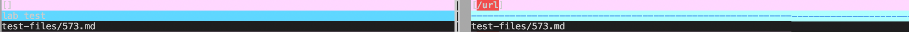
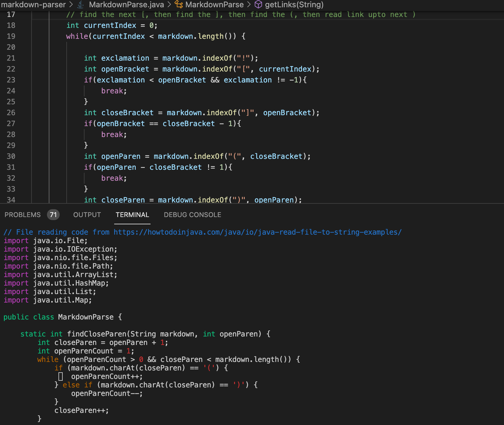
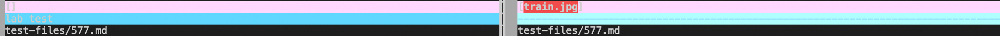

# Aung Myat, June 2nd, 2022
# Lab Report 5
[Home Page](https://ruff1ezzz.github.io/cse15l-lab-reports/index.html)

***

**Lab Report 5:**

## 1) Using a Script to Run Many Files

Firstly, at the start of this lab, my labmate and I had to clone a given repository of a new MarkDownParse repository and ran `time bash script.sh` to see how long it took to run the bash script for a total of 652 test files.

The result:

Then we edited the `script.sh` file by adding `echo $file` under the `java MarkdownParse $file`. This prints out the names of the test files after every result is printed.

We then use the copied the results into a new text file called `reuslts.txt` by using the command `bash script.sh > results.txt`. This command takes all the texts that `bash script.sh` prints and copy it into a new file `results.txt`.

Then, I cloned my version of MarkdownParse into my ssh ieng6 server too and copied the `text-files` directory and `script.sh` file into my cloned MarkdownParse repository from the given repository. I used these command to do that: "`cp -r cse15lsp22-markdown-parser/test-files my-markdown-parser/`" and "`cp cse15lsp22-markdown-parser/script.sh my-markdown-parser/`"

Finally, I followed the same steps of creating a new `result.txt` file and copying the results of my version of `markdownparse`.

## 2) Comparing Two Implementations

Now that we have 2 different `results.txt` file, one in my cloned MarkDownParse repository and another in the given repository, we can compare it using `vimdiff`.

First, I went back into my home directory by running `cd ~` command and then running `$ vimdiff my-markdown-parser/results.txt cse15lsp22-markdown-parser/results.txt` command.

After running the command this is what I got:

I just scroll through manually to spot the differences in the results.

Here is the link of the first test-file with different results:
[Different result](https://github.com/nidhidhamnani/markdown-parser/blob/main/test-files/573.md)

> Preview to check if link is valid:
>
>](/url2)

The above "foo bar" doesn't work because it's an invalid link so the expected output should be just `[]`. Below is the output of `573.md` for both `my-markdown-parser` and the `cse15lsp22-markdown-parser`:

On the left it shows the result of `my-markdown-parser` and the right shows the result of `cse15lsp22-markdown-parser`.

Based on the test results, my implementation of markdown parser is correct because the result is an empty list. The syntax `](/url2)` has many errors and especially since the format of how the link is written includes an `!` at the very beginning, it is the syntax of writing an image link, therefore the url is invalid and it shouldn't be added to the list. 

This wrong output error in `cse15lsp22-markdown-parser` is occuring because in the `MarkdownParse.java` file in that repository, the `MarkdownParse` method doesn't check if an exclamation mark makes a link valid or not. Therefore the result of that `MarkdownParse` method will still include the link of an image in the list.

In the image above, the code in the upper part is from my `MarkdownParse.java` file and the code in the terminal is from `cse15lsp22-markdown-parser` repository. All you need is to add code from line 21 to 25 from my `MarkdownParse.java` into the `cse15lsp22-markdown-parser` repository's `MarkdownParse` method.

***

Here is the link of the second test-file with different results:
[Different result](https://github.com/nidhidhamnani/markdown-parser/blob/main/test-files/573.md)

> Preview to check if link is valid:
>
>

The above error is similar to the first test-file. The text in this `577.md` file is written in the syntax for image link. Below is the output of `573.md` for both `my-markdown-parser` and the `cse15lsp22-markdown-parser`:

On the left it shows the result of `my-markdown-parser` and the right shows the result of `cse15lsp22-markdown-parser`.

Based on the test results, my implementation of `MarkdownParse` is correct because the result of my `MarkdownParse` is an empty list. The syntax `` doesn't have any errors in its own form of syntax but the format of how the link is written includes an `!` at the very beginning which turns it into an image link, therefore the url is invalid and it shouldn't be added to the list. 

Just like the `573.md` test file, this wrong output error in `cse15lsp22-markdown-parser` is occuring because in the `MarkdownParse.java` file in that repository, the `MarkdownParse` method doesn't check if an exclamation mark makes a link valid or not. Therefore the result of that `MarkdownParse` method will still include the link of an image in the list.

You can just add the code from line 21 to 25 and paste it in the code in the terminal right after the while loop, so that the `markdownparse` method can instantly break when it detects an `!` in the test-file.