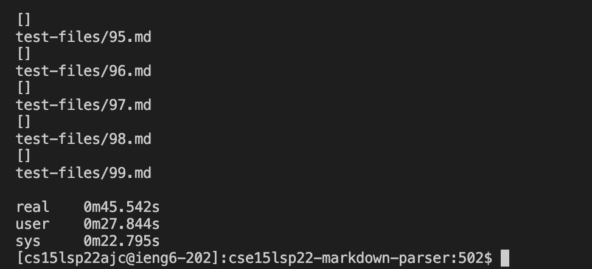

# Aung Myat, June 2nd, 2022
# Lab Report 5
[Home Page](https://ruff1ezzz.github.io/cse15l-lab-reports/index.html)

***

**Lab 9:**

## 1) Using a Script to Run Many Files

Firstly, at the start of this lab, my labmate and I had to clone a given repository of a new MarkDownParse repository and ran `time bash script.sh` to see how long it took to run the bash script for a total of 652 test files.

The result:

Then we edited the `script.sh` file by adding `echo $file` under the `java MarkdownParse $file`. This prints out the names of the test files after every result is printed.

We then use the copied the results into a new text file called `reuslts.txt` by using the command `bash script.sh > results.txt`. This command takes all the texts that `bash script.sh` prints and copy it into a new file `results.txt`.

Then, I cloned my version of MarkdownParse into my ssh ieng6 server too and copied the `text-files` directory and `script.sh` file into my cloned MarkdownParse repository from the given repository. I used these command to do that: "`cp -r cse15lsp22-markdown-parser/test-files my-markdown-parser/`" and "`cp cse15lsp22-markdown-parser/script.sh my-markdown-parser/`"

Finally, I followed the same steps of creating a new `result.txt` file and copying the results of my version of `markdownparse`.

## 2) Comparing Two Implementations

Now that we have 2 different `results.txt` file, one in my cloned MarkDownParse repository and another in the given repository, we can compare it using `vimdiff`.

First, I went back into my home directory by running `cd ~` command and then running `$ vimdiff my-markdown-parser/results.txt cse15lsp22-markdown-parser/results.txt` command.

After running the command this is what I got:

I just scroll through manually to spot the differences in the results.

